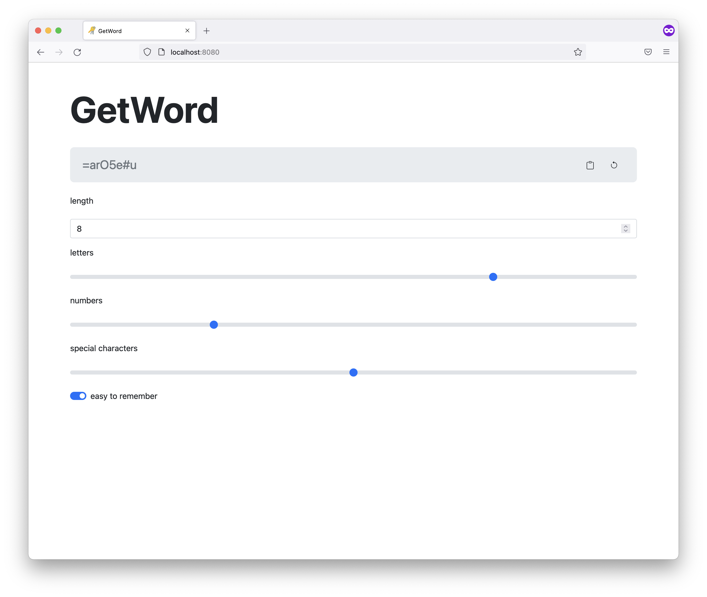

<h1 align="center">GetWord</h1>

A website to generate passwords

 

    
    
    

##

[• Description](#-description)  
[• Usage](#-usage)  
[• Contribution](#-contribution)  
[• License](#%EF%B8%8F-license)

## 📙 Description

GetWord is a website to generate passwords with various features:

-   Length
-   Percentage of letters, numbers, special characters
-   Generate easy to remember passwords (with more vowels)
-   Copy to clipboard and generate a new one using buttons at the top

## 🖥 Usage

### Setup & requirements

The application needs a modern version of PHP (PHP 8.0 or newer at the moment).

## 🙋‍ Contribution

Contributions are always very welcome! It's completely equal if you're a beginner or a more experienced developer.

Thanks for your interest 🎉👍!

## 👨‍⚖️ License

[MIT](https://github.com/jarne/GetWord/blob/master/LICENSE)

### Attributions

[Icon](https://iconarchive.com/show/small-n-flat-icons-by-paomedia/keyring-icon.html) by [paomedia](https://github.com/paomedia) (under Public Domain license)
